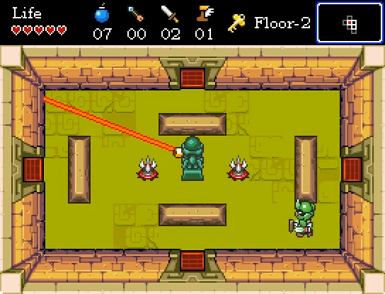

# Draco's Tower
Roguelike game with The Legend of Zelda / The Binding of Isaac style, made with PyGame. It features:
- Random floor generation, with secret rooms.
- Different room layouts and tilesets.
- Multiple weapons (sword, bombs, bow).
- Random pickups (hearts, bombs, arrows).
- Ability upgrades (speed, health, attack power).
- 8 different enemies.

This project was developed for a game design subject of the Computer Science Degree at University of A Coruña.

[Gameplay video on YouTube](https://youtu.be/VK6KV0CVgUU?si=3Ys6zHVKwWisC0Gb)

